# 第六章 类与集合

+++

[TOC]

+++


## 类与对象

### UML （unified modeling language）


面向对象的分析和设计 (object-ontented analysis)、 (object-ontented design)


### 类(class)是实现面向对象程序设计(OOP)实现信息封装的基础

     

1. 类的声明

   声明一个类的关键字

   ```c++ 
   //声明一个类
   class A
   {
   public:
       void get();
   private:
   	int a;	    
   }
   
   //定义一个类
   class B
   {
   public:
   	void get()
       {
           cout<<b<<endl;
       }
   private:
       int b;
   }
   ```

2. 类的成员

   +  数据成员：描述对象的属性
   + 成员函数：描述对象的方法

3. 类的声明通常放在头文件，成员函数一般定义在一个cpp文件中

   + 主函数注意调用头文件Tdate.h

     

   + 类的定义在头文件中

     

   + 成员函数一般写在一个cpp文件中（也可以直接在类中定义，此时被视为内联函数）。在cpp文件中定义函数时要注意调用包含类定义的头文件并注意函数首部写法。

4. 类中的一般函数不自动执行，只有调用才会执行

5. 类中成员的性质分为public、protected、private

   | 关键字    | 特点                                 |
   | --------- | ------------------------------------ |
   | private   | 仅在类中可见，不能类外和派生类中使用 |
   | protected | 仅在类和派生类中可见                 |
   | public    | 在类中和类外均可见                   |

   （类的访问控制详见第八章“继承”）

6. 注意事项

   1. 允许已经定义的类名出现在类的说明中，但不可以出现无穷递归结构

   2. 类声明不可以无名（错误C4094）。类对象可以无名，用于直接声明对象[（具体可以参考这篇文章）](https://blog.csdn.net/qq_41929943/article/details/104838818)

   3. 类是一个程序包。包含数据成员、成员函数，也可以只有数据成员、只有成员函数、空

   4. 类可以嵌套

      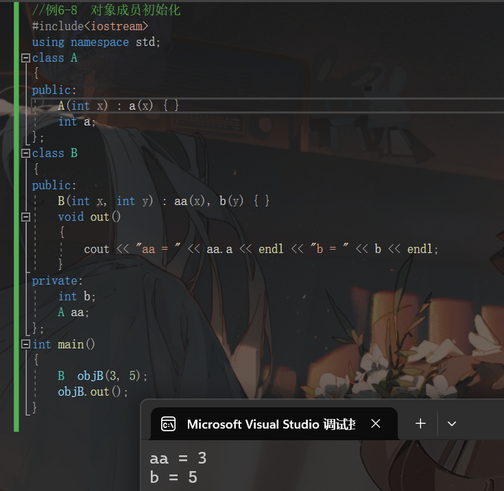

   5. 若没有数据成员，则类的大小为1

   6. 若有数据成员，则类的大小就是数据成员的总大小（与成员函数无关，静态数据成员也不占用存储空间）

      

7. 访问对象成员

   + 能在类外访问对象一定是有public属性

   + 当类的成员定义为private或protected时，只能在类中初始化，但可以通过成员函数修改

     

     

   + private和protected实现了信息的隐藏

   + 可以使用‘.’和’->’访问公有成员

8. this 指针

   + this 指针是一个常指针，一旦被初始化（成员函数被调用时初始化）就不能修改，这相当于class_Type * const this

   1. 

     obj1、obj2都有setXY()函数，为什么10、15不会赋值给obj2呢?

   2. 原因：成员函数实际包含了一个this指针，调用时会自动传递一个当前类变量的一个指针

   3. 但是在编程时不应在参数中写出来

   4. 当形参变量和类成员名字相同时会产生问题

     此时就需要this指针

     但不建议这样做，形参最好不要和对象名重合

9. 成员函数可以直接调用类中数据成员而不需要参数

   


### 构造函数与析构函数

1. 构造函数

2. 析构函数

3. 构造函数和析构函数不符合一般函数定义，是类的特殊函数，不应该定义在private部分

4. 一旦创建类变量，自动执行构造函数；一旦类的对象生命周期结束，自动调用析构函数

5. 创建指针变量时，只有删除指针时才会执行析构函数

   

   

6. 带参数的构造函数——用于初始化对象的数据成员

   

   另一种写法（冒号写法）这种写法仅适用于构造函数                          

   

   冒号写法有些情况不完全等价于赋值写法

   对于构造函数来说，先执行冒号后的，再执行函数内部

   

6. 对象的构造次序和析构次序是相反的，首先创建的对象最后析构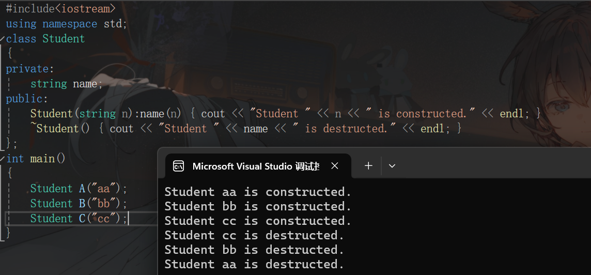

8. 重载构造函数

   

   类似于普通函数的重载，要注意可能存在的二义性问题。

9. 复制构造函数

   + 复制构造函数**不是**构造函数

   + 格式：**类名** **::** **类名**（**const** **类名** **&** **引用名** **, …**）

   + | 构造函数                   | 复制构造函数                                         |
     | -------------------------- | ---------------------------------------------------- |
     | 自力更生创建一个类类型变量 | 基于一个原有的一个类类型变量，创建一个新的类类型变量 |

   + 应用1：用已有类类型变量创建一个新的类类型变量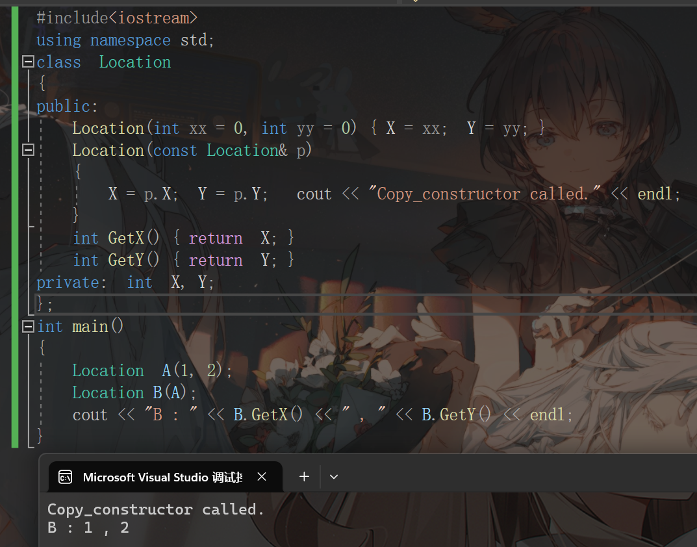

   + 应用2：函数的类类型实参初始化形参时，调用复制构造函数

     + 补充：如果形参是引用类型不用调用构造函数（也就意味着节省了空间）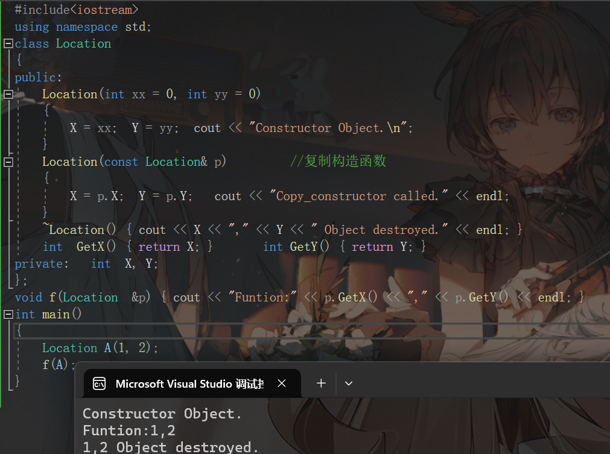

   + 应用3：函数返回类类型时，通过复制构造函数建立临时对象（obj)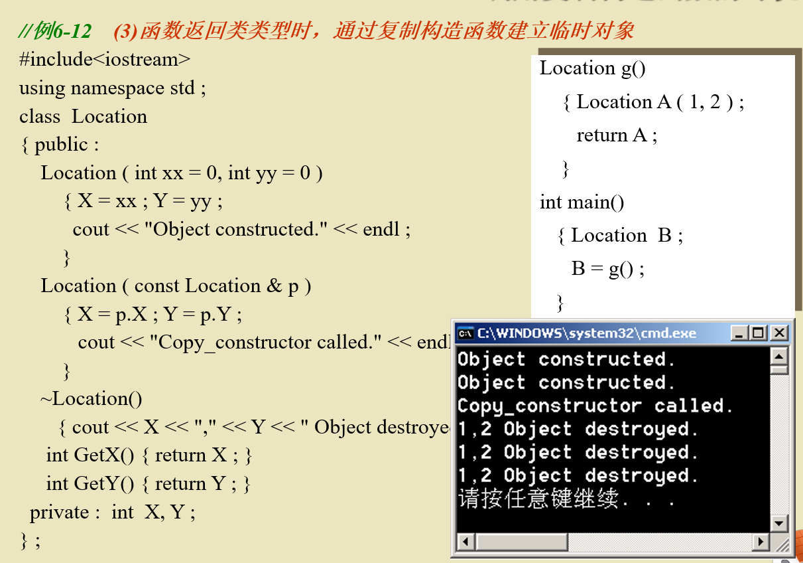

     + 注意：在最新的编译器中会有不同，可能是优化了obj的创建（调用复制构造函数）和删除，可以通过逐步调试探索
       
       后补：可能跟复制消除的NRVO和RVO有关
       
       + 若返回引用类型则会出现警告这是因为obj与A共用存储空间，但在函数返回赋值给B之前会删除A的内存
   
   + 系统默认构造函数
   
     + 系统默认构造函数仅可以完成数据成员简单复制，相当于这样
   
     + 如果自定义了复制构造函数，就要写完整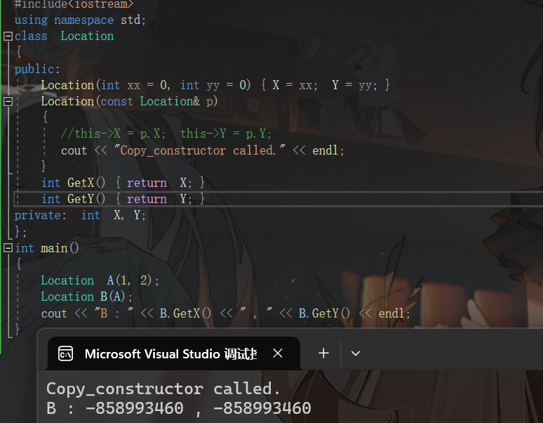
   
       定义了复制构造函数就不会再调用系统默认的复制构造函数
   
     + 必须要自定义复制构造函数的情况（深复制）
   
       ```c++
       #include <iostream>
       
       class DeepArray {
       private:
           int* data;
           int size;
       
       public:
           DeepArray(int s) : size(s) {
               data = new int[size];
               for (int i = 0; i < size; ++i) {
                   data[i] = i;
               }
           }
       
           ~DeepArray() {
               delete[] data;
           }
       
           DeepArray(const DeepArray& other) : size(other.size) {
               data = new int[size];
               for (int i = 0; i < size; ++i) {
                   data[i] = other.data[i];
               }
           }
       
           void display() const {
               for (int i = 0; i < size; ++i) {
                   std::cout << data[i] << " ";
               }
               std::cout << std::endl;
           }
       
           void changeElement(int index, int value) {
               if (index >= 0 && index < size) {
                   data[index] = value;
               }
           }
       };
       
       int main() {
           DeepArray arr1(5);
           DeepArray arr2 = arr1;
       
           std::cout << "数组 1: ";
           arr1.display();
           std::cout << "数组 2: ";
           arr2.display();
       
           arr1.changeElement(2, 100);
       
           std::cout << "数组 1（更改后）：";
           arr1.display();
           std::cout << "数组 2（未更改）：";
           arr2.display();
       
           return 0;
       }
       
       ```
   
       结果
   
       如果不写复制构造函数arr2和arr1共用一片内存
   
       同时因为在调用arr1的析构函数时这片内存已经被删除，再调用arr2的析构函数会出现无效删除而报错
   
   + const 仅是一个保护作用，去掉也可以创建新的类类型变量
   
   +++
   
   

## 常成员

###	常数据成员

1. 常数据成员是指数据成员在实例化被初始化后约束为只读；常成员函数是指成员函数的his指针被约束为指向常量的常指针，函数体内不能修改数据成员的值。

2. 常成员在被初始化后就不能修改，不论内外

   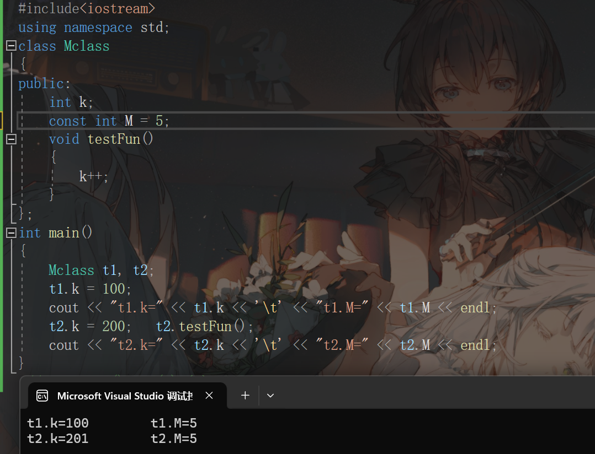

   错误案例

   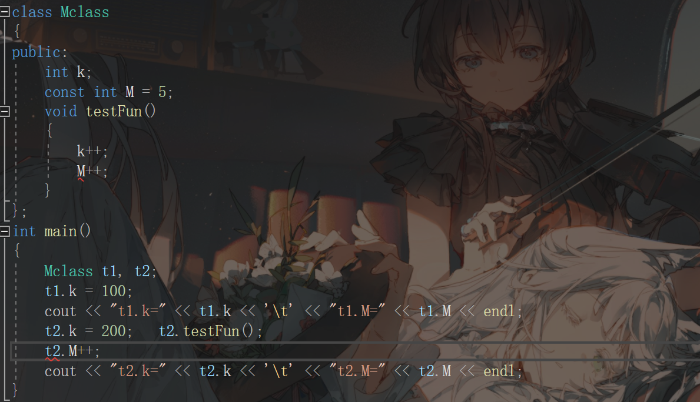

3. 常成员赋值可以通过构造函数定义，必须要使用：格式

   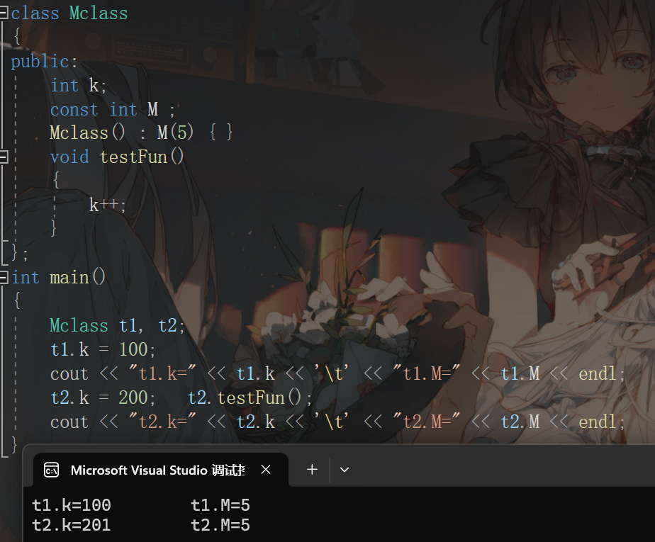

   这一点和普通的常量变量的初始化不同，可以不在定义的时候初始化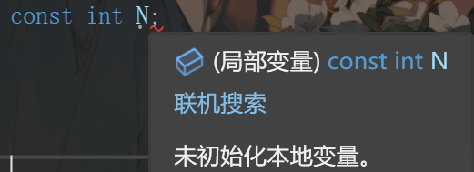
   
   

### 常对象

1. 在定义并初始化后不能再修改类中成员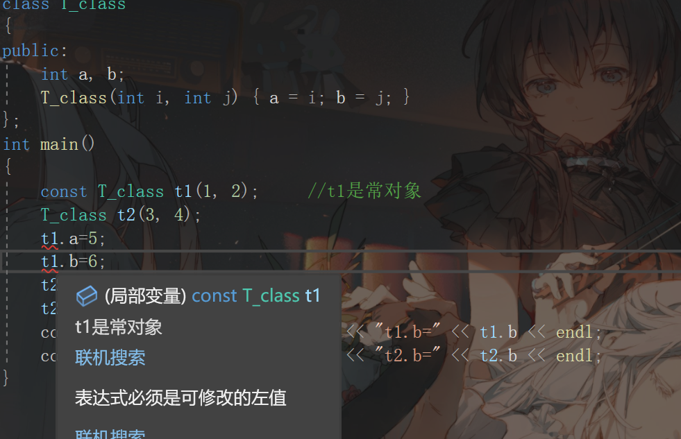

### 常成员函数

1. 常成员函数调用不会改变数据成员的值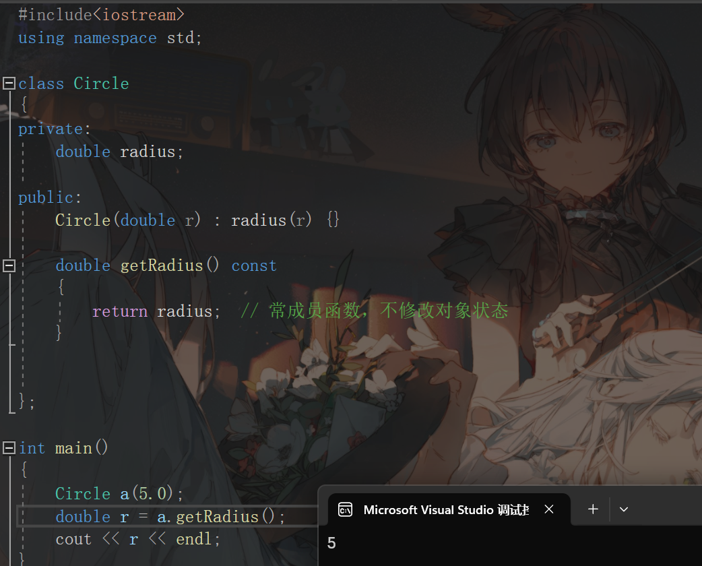
1. 不允许改变类成员的值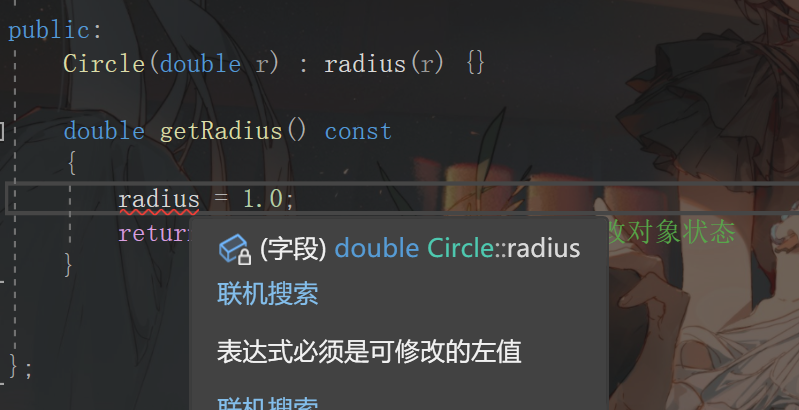

------


## 静态成员

### 静态数据成员

1. 相同类类型变量共用一个静态数据成员，是一个全局变量，要求类中声明，类外定义（用于分配存储空间）。
2. 静态类型成员可以直接通过类访问，也可以通过类变量访问（不推荐），会被关键字public、protected、private约束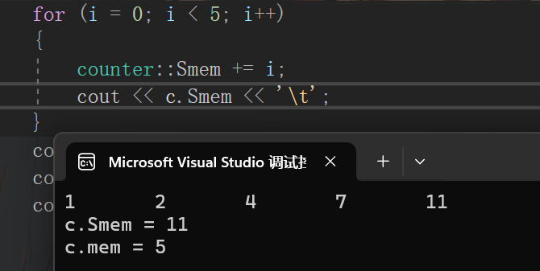


### 静态成员函数


1. 静态成员函数没有this指针，如果要修改某个具体对象的值需要一个指针（不推荐）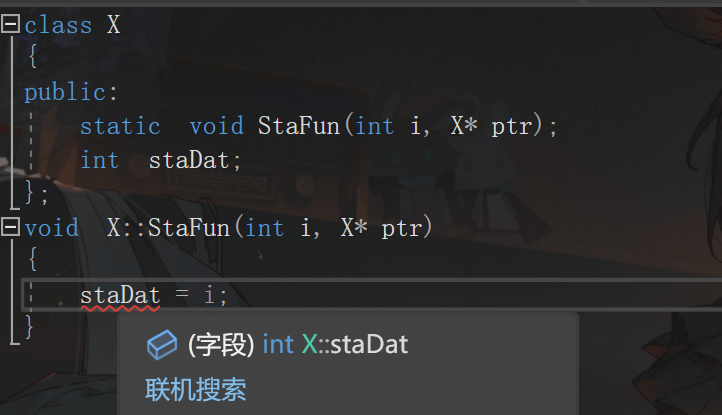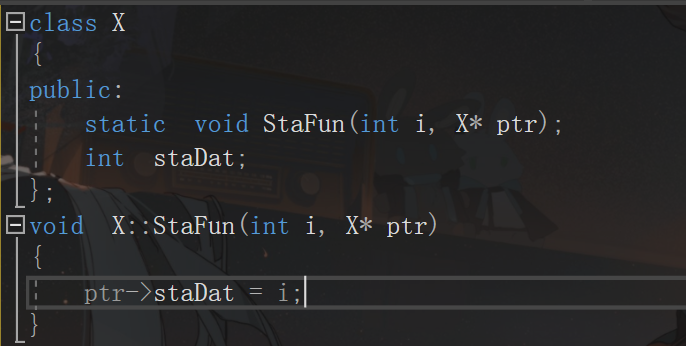
2. 静态成员函数可以直接修改静态数据成员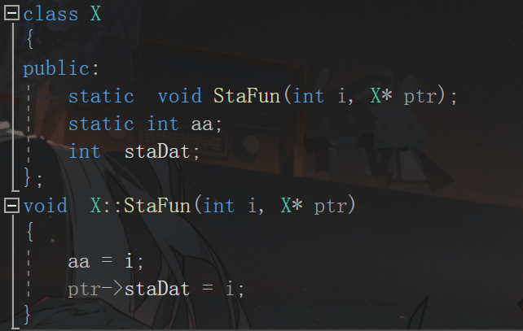

+++


## 友元（friend)

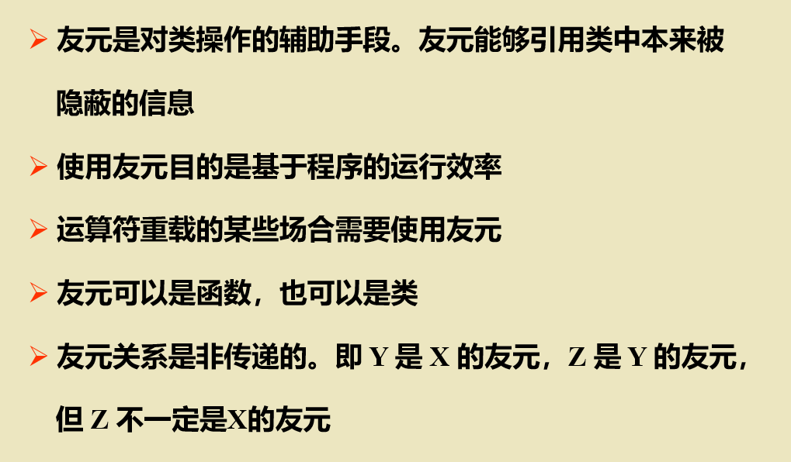

### 友元函数

1. 友元函数可以直接访问类中的private部分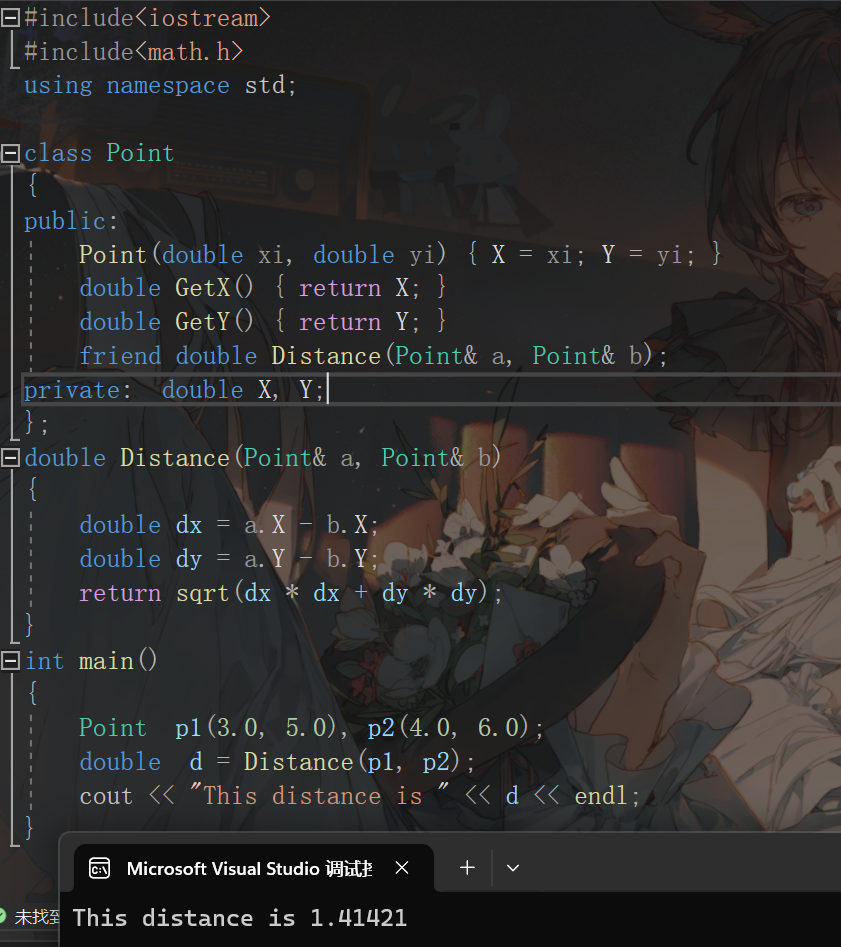
2. 成员函数不是类的成员，是一个全局函数，因此在访问private的时候需要指针确定具体访问的类
3. 从结果上来看，可以改成成员函数，但从实际理解角度，最好使用友元函数，因为这个函数实际意义不在某个类中（如distance不能说是某个点的距离）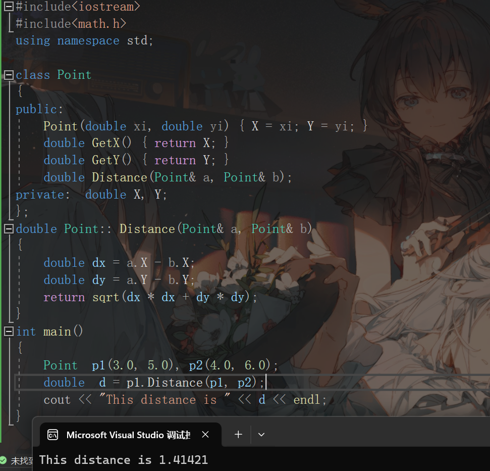


### 友元类

1. A的友元类B中的所有成员函数都是A的友元函数，是一种辅助的类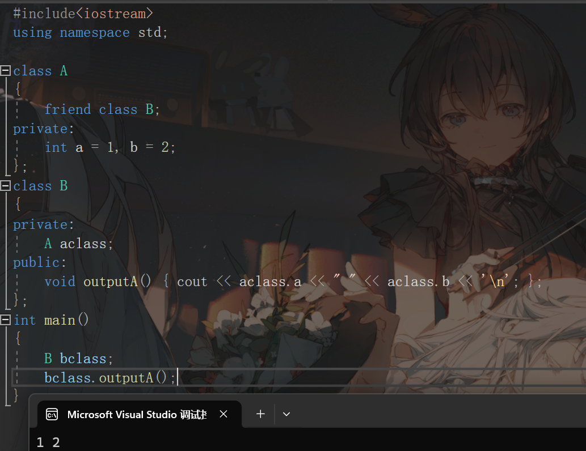
2. 不声明友元类就不可以访问另一个类的具有private性质的对象
3. 通过友元类不能间接实现类外访问private成员

+++


### 类的包含

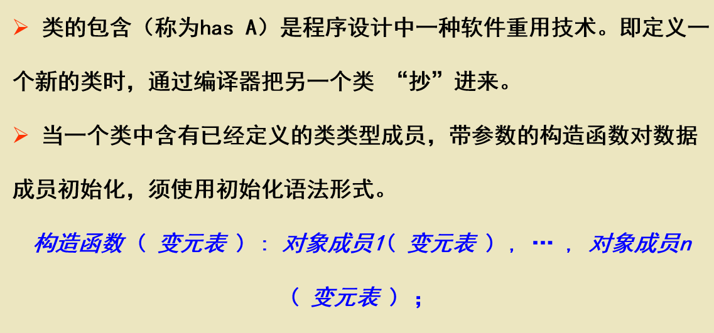

1. 类的包含（包含关系）通常指一个类内部包含另一个类的对象作为其成员

2. 初始化s的时候同时也初始化s.dob，这时候只能运用参数初始化格式（即冒号格式）初始化s.dob

   

3. 即使一个Date类变量dob被包含在Student类中，在Student类中仍然不能访问Date类的private部分

   

   

   

   

   

   

   

   

   